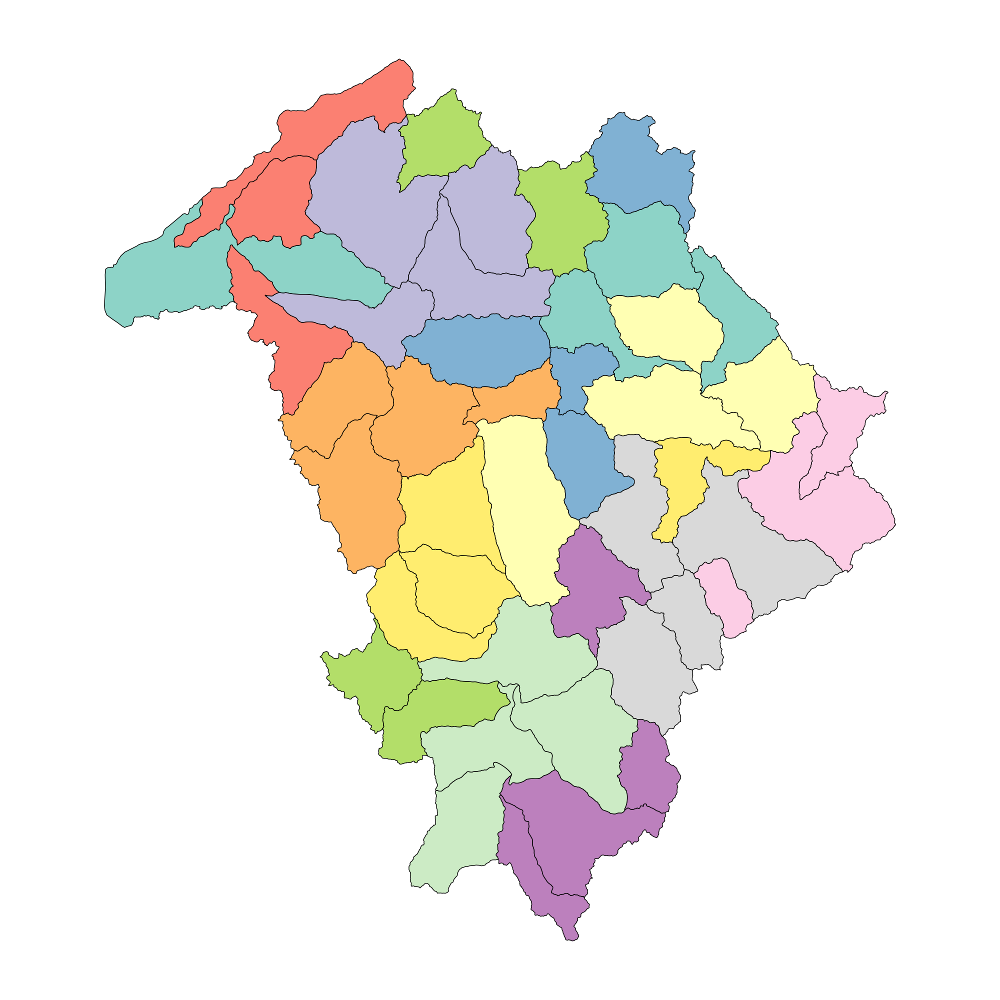

# 🌱 Portneuf River Watershed – Initial Hydrologic Analysis 

This repository contains scripts and tools developed for collecting, processing, and analyzing hydrological data using **Google Earth Engine (GEE)** and **Python**. The focus is on extracting weather (**gridMET**, **PRISM**),
 evapotranspiration (**gridMET**, **OpenET**), and crop/land cover datasets (**CDL** and **NLCD**).

---

<p align="center">
  <br>
  <em>Portneuf Landcover for year 2005 </em>
</p>


## Repository Structure

```
/
├── earthengine-js/         # JavaScript GEE scripts (linked below and has no folder in repo)
├── ee_python/              # Python API scripts for GEE
├── prism_code/             # Python script to download prism data using api request
├── analysis/               # Jupyter Notebooks for exploration or analysis on HUC12 level
├── analysis2/              # Jupyter notebook with analysis based on landcover and Portneuf watershed is divided into three subwatershed
└── README.md
```

---

## Earth Engine Scripts (JavaScript)

> All JavaScript scripts are hosted in the shared GEE repository below:

- **[Main Earth Engine Repo](https://code.earthengine.google.com/?accept_repo=users/dineshgulati333/portneuf)**

### Key Scripts:
- [AOI](https://code.earthengine.google.com/04ed0ef0d846c984ba70f92b09c098e3?noload=true)
- [DEM](https://code.earthengine.google.com/8a4f83eb51d3816680a5d69b3a242877?noload=true)
- [NLCD_raster](https://code.earthengine.google.com/a3fe2b54555fdb5171df1536538c22f5?noload=true)
- [PRISM_HUC12](https://code.earthengine.google.com/3a589bef56fe00c7932df5b1ae6cf2b7?noload=true)
- [gridMET_HUC12](https://code.earthengine.google.com/3a589bef56fe00c7932df5b1ae6cf2b7?noload=true)
- [gridMET_3P_mask](https://code.earthengine.google.com/c6cb7eb3731cf645e1a50812a79e407a?noload=true)  
- [twave_gmet](https://code.earthengine.google.com/eb3b75716e7bd6e2085547a199352331?noload=true)  
- [twave_gmet_cl_mask](https://code.earthengine.google.com/9bbdddda99ec19199ddee9972446449f?noload=true)

---

## Earth Engine Python API Scripts

Located in `ee_python/`:

*You can also launch each notebook directly in Google Colab by clicking its name below.*

| Script | Description |
|--------|-------------|
| [`Pneuf_OpenET_HUC12.ipynb`](https://colab.research.google.com/drive/1P96ucjloKNYB6zGVJaOf-NPjfFCZBORC?usp=sharing) | Extract all OpenET models including ensemble for multiple years. It will apply reducer to each HUC12 feature to calculate mean, 25th, median, 75th in the region |
| [`Pneuf_NLCD_huc12.ipynb`](https://colab.research.google.com/drive/1SCJKQz_25yTdX0zxWWCqH2N4Dfagd9Qg?usp=sharing) | Extract the NLCD landcover data for a specific region and export it as CSV for individual years in Drive |
| [`Pneuf_CDL_huc12.ipynb`](https://colab.research.google.com/drive/1HRpv_C9NJIPUmtUKI-l0NPDKljgI23zd?usp=sharing) | Extract the USDA CDL landcover data for a specific region and export it as CSV for individual years in Drive |
| [`Pneuf_IrrMAPPER_huc12.ipynb`](https://colab.research.google.com/drive/1umnEEfXe8YjtBiTRnbxv9v5J67vKRzqD?usp=sharing) | Extract irrigated area within each HUC12 for multiple years using IrrMapper dataset |
| [`Pneuf_NPP_huc12.ipynb`](https://colab.research.google.com/drive/1xvwzCJuDBCppItKz_jWiOy6CKvDXGZWc?usp=sharing) | Extract Landsat based NPP data for each HUC12 |
| [`Pneuf_OpenET_3p_mask.ipynb`](https://colab.research.google.com/drive/1YCHq0dG1iboq9n3JBqeLjQbrg2BgnzQy?usp=sharing) | OpenET data modified for cultivated and non-cultivated scenarios based on NLCD 2005 LC mask and Portneuf with three sub watersheds |
| [`Pneuf_NLCD_3P.ipynb`](https://colab.research.google.com/drive/1vbsMJZk1RnIRQLDA-EFD-M7qPdzH9BXk?usp=sharing) | Code modified to extract NLCD LC for three features within Portneuf |

---

## 📊 Data Analysis Scripts

Located in `analysis/`:

*This folder contains comprehensive analyses at the HUC12 level within the Portneuf watershed. It includes all relevant datasets, their preprocessing workflows, and detailed analytical scripts for trend detection, statistical summaries, and visualization.*

<p align="center">
  <br>
  <em>Map of HUC12 regions used for analysis</em>
</p>


| Folders | Description |
|--------|-------------|
| `cdl` | USDA CDL data merging, preprocessing and trend analysis (Mann-Kendall, Sen's Slope) along with graphics |
| `gridmet` | gridMET precip, temp, eto, and etr data , preprocessing, stats and trend analysis (Mann-Kendall, Sen's Slope) along with graphics |
| `IRR` | IrrMapper data merging and initial analysis along with graphics |
| `nlcd` | NLCD data merging and initial analysis along with graphics |
| `npp` | Landsat NPP data merging and initial analysis along with graphics |
| `openet` | OpenET data merging and initial analysis along with graphics. Also include dataset of each individual model |
| `portneuf_aoi` | Dissolved Portneuf shapefile |
| `portneuf_huc12` | Portneuf shapefile with HUC12 features |
| `utils` | Contains modular Python utility scripts offering reusable functions for statistical trend analysis (Sen's Slope, Mann-Kendall tests), data preprocessing, and automated generation of high-quality, publication-ready plots. These utilities streamline workflows and are leveraged across multiple notebooks for consistency and efficiency |
---

> **Note:**  
> If you are using the `trend_sen` module (which provides functions for calculating Sen's Slope, generating plots, etc.), you may need to update the import path based on your local directory structure. This is typically done by modifying the Python `sys.path` using the `os` and `sys` libraries to ensure your scripts can locate and import custom modules.  
>  
> Example:
> ```python
> import os
> import sys
> sys.path.append(os.path.abspath('path/to/your/module'))
> import trend_sen
> ```


Located in `analysis2/`

*This folder contains comprehensive analyses at the three subwatersheds within the Portneuf watershed. The other difference is each variable is further segregated into cultivated (cropland and pasture) and non-cultivated area based on NLCD layer (2005). It includes all relevant datasets, their preprocessing workflows, and detailed analytical scripts for trend detection, statistical summaries, and visualization.*

<p align="center">
  <br>
  <em>Division of watershed into three UIDs (101, 102, 103) for targeted zonal analysis</em>
</p>

| Folders | Description |
|--------|-------------|
| `gridmet` | gridMET precip, temp, eto, and etr data , preprocessing, stats and trend analysis (Mann-Kendall, Sen's Slope) along with graphics |
| `nlcd` | NLCD data merging and initial analysis along with graphics |
| `nlcd_raster` | Map code based on NLCD geotiff |
| `openet` | OpenET data merging and initial analysis along with graphics based on landcover. Also include dataset of each individual model |
| `shp` | Contains shapefile used in all the analysis. `portneuf3_clean` is the final shapefile |
---

## Getting Started

1. **Clone the repository**:
   ```bash
   git clone https://github.com/dineshgulati933/portneuf_IWRRI.git
   cd portneuf_IWARRI
   ```

2. **Authenticate and initialize Earth Engine** (for Python API):
   ```python
   import ee
   ee.Authenticate()
   ee.Initialize()
   ```

3. **Run scripts** as needed from the appropriate folders.

---

## Requirements

- Google Earth Engine Python API
- `pandas`, `geopandas`, `matplotlib`, `rasterio`, `shapely`, `numpy`
- Earth Engine authentication enabled

---

## Credits

Developed by **Dinesh Gulati**  
Project under **IWARRI**, **UOI**  
Summer 2025

---

## Contact

For questions:  
[Email](mailto:gula7530@vandals.uidaho.edu)  
[LinkedIn](https://www.linkedin.com/in/dinesh-gulati-120779149/)
